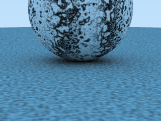

## Tracer

Toy raytracer created while reading [Ray Tracing in One Weekend](https://www.amazon.com/Ray-Tracing-Weekend-Minibooks-Book-ebook/dp/B01B5AODD8/), by Peter Shirley.

Most recent output:



### Requirements

- C++14 compiler (GCC 5.4.0+ or Visual Studio 17+)

### Build

`cd` to the directory and `make`

### Usage

```
./bin/tracer /path/to/output.png
```
